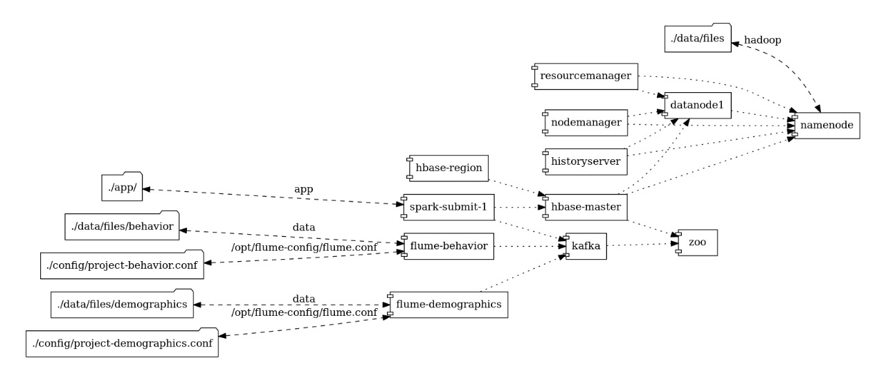
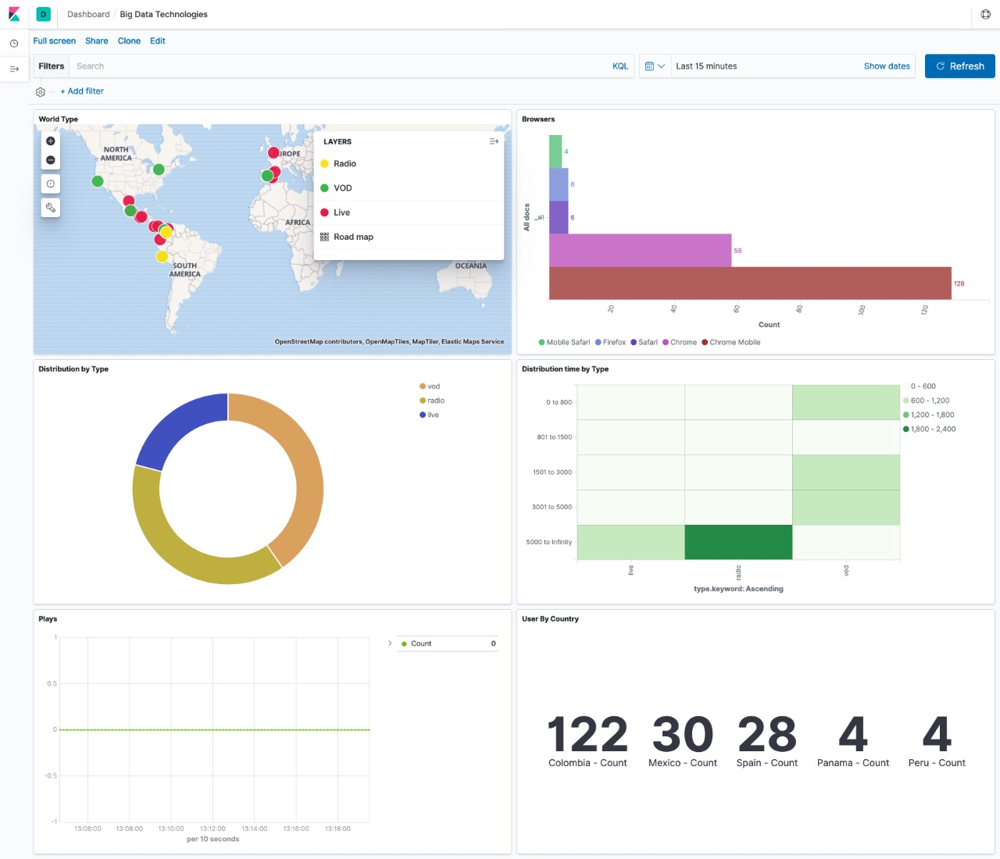

# VideoStreamng
Use of Big Data Technologies to analize the users’ behavior in a video streaming organization.

## Used Technologies
Flume, Kafka, Spark Streaming, Hbase, Hive, Spark Sql and Elastic Search and Kibana, Amazon EC2 and Docker.

## Topology

## Visualization Tool : Kibana

